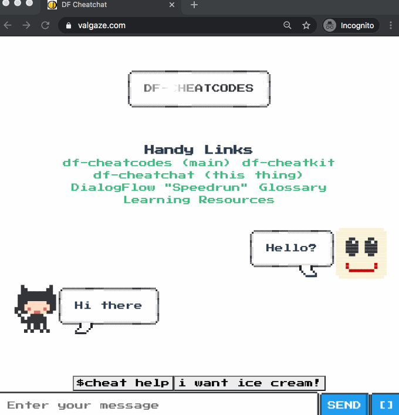
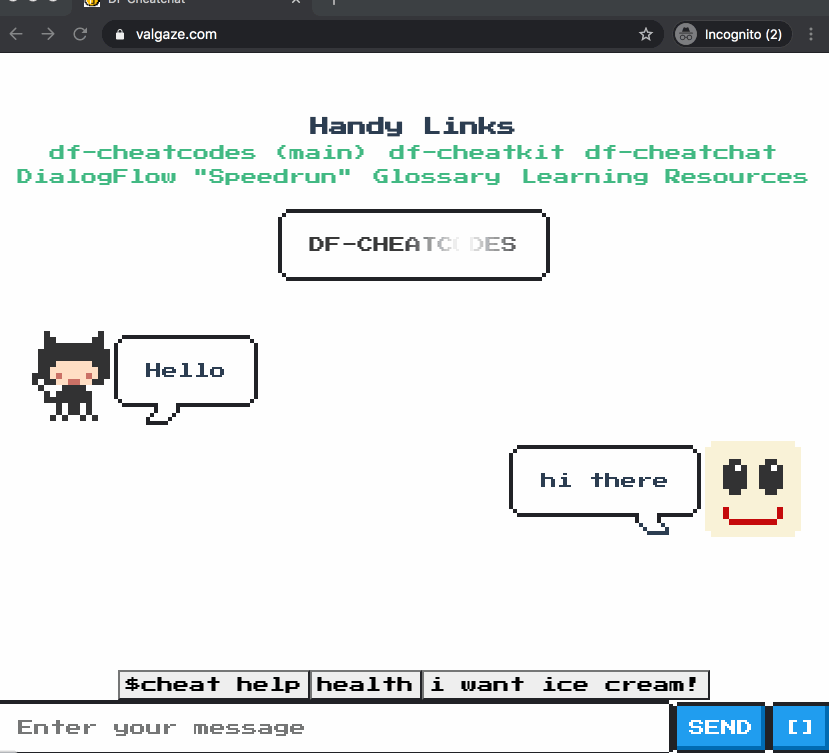
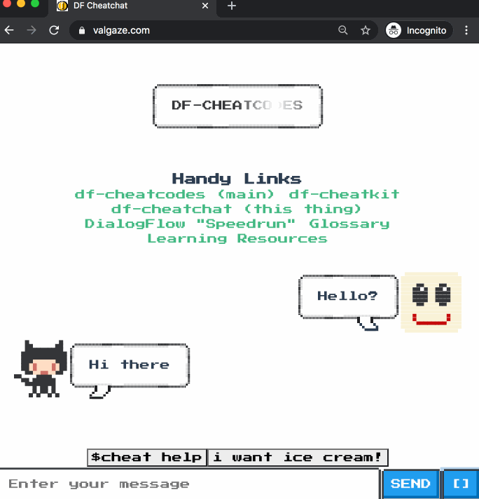

## Features

This frontend is equippeed lots of handy conversational design/engineering tools

## Debug Mode

See detailed logs and inspect component responses

## Request Debugger

Easily send events, copy/paste requests for transmission outside of chat (like Postman & similiar tooling)

## Change backend

NOTE: This only applies to your browser, see **[here](./../quickstart.md)** for creating a bundle

## UI

- Cycle through message history using up & down arrows

- Custom components (see **[https://github.com/valgaze/df-cheatcodes](https://github.com/valgaze/df-cheatcodes)**)
